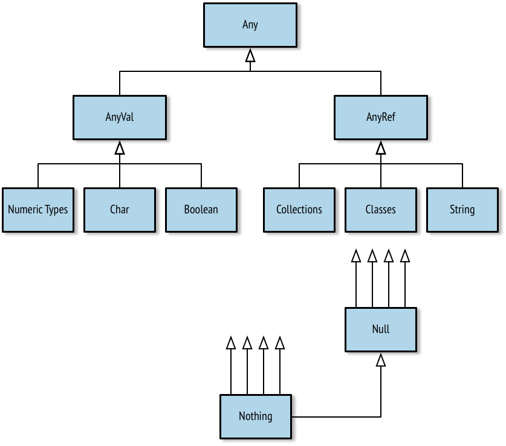
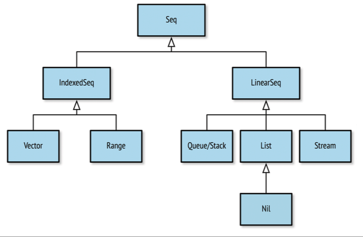



## Why Learning Scala

* Your Code Will Be Better
* You’ll Be a Better Engineer
* You’ll Be a Happier Engineer
* **But** Scala has a reputation for being difficult to learn

## Get Started

### REPL (a Read-Evaluate-Print-Loop shell)

	scala> :load Hello.scala
    Loading Hello.scala...
    Hello, World

## Data:
* A _**literal**_ (or literal data) is data that appears directly in the source code, like the number 5, the character A, and the text “Hello, World.”
* A _**value**_ is an immutable, typed storage unit. A value can be assigned data when it is defined, but can never be reassigned.
* A _**variable**_ is a mutable, typed storage unit. A variable can be assigned data when it is defined and can also be reassigned data at any time.
		
	**var** \<name>: \<type> = \<literal> | \<data>
* A _**type**_ is the kind of data you are working with, a definition or classification of data. All data in Scala corresponds to a specific type, and all Scala types are defined as classes with methods that operate on the data. 
	
	**val** \<name>: \<type> = \<literal> | \<data>
	
## Types
### String: **interpolation**
		
		scala> val approx = 355/113f
  		approx: Float = 3.141593
    	scala> println("Pi, using 355/113, is about " + approx + "." )
	    Pi, using 355/113, is about 3.141593.

	    scala> println(s"Pi, using 355/113, is about $approx." )
    	Pi, using 355/113, is about 3.141593.

    	scala> val item = "apple"
    	item: String = apple

    	scala> s"How do you like them ${item}s?"
   		res0: String = How do you like them apples?
    	scala> s"Fish n chips n vinegar, ${"pepper "*3}salt"
    	res1: String = Fish n chips n vinegar, pepper pepper pepper salt

    	scala> val item = "apple"
    	item: String = apple
    	scala> f"I wrote a new $item%.3s today"
    	res2: String = I wrote a new app today
    	scala> f"Enjoying this $item ${355/113.0}%.5f times today"
    	res3: String = Enjoying this apple 3.14159 times today

    	
### String: **Regular expressions**

| Name | Example | Description |
| ------------ | ------------- | ------------ |
| matches | "Froggy went a' courting" matches ".* courting" | Returns true if the regular expression matches the entire string. |
| replaceAll | "milk, tea, muck" replaceAll ("m[^ ] +k", "coffee") | Replaces all matches with replacement text. |
| replaceFirst | "milk, tea, muck" replaceFirst ("m[^ ] +k", "coffee") | Replaces the first matche with replacement text. |

* Syntax: Capturing Values with Regular Expressions
		
		val <Regex value>(<identifier>) = <input string>
			
		scala> val input = "Enjoying this apple 3.14159 times today"
    	input: String = Enjoying this apple 3.14159 times today

    	scala> val pattern = """.* apple ([\d.]+) times .*""".r
    	pattern: scala.util.matching.Regex = .* apple ([\d.]+) times .*
    			
		scala> val pattern(amountText) = input
    	amountText: String = 3.14159
    			
		scala> val amount = amountText.toDouble
   		amount: Double = 3.14159

### Boolean, What is the Difference Between & and && ?


* The Boolean comparison operators && and || are lazy in that they will not bother evaluating the second argument if the first argument is sufficient. 
* The operators & and | will always check both arguments before returning a result.
* Scala does not support automatic conversion of other types to Booleans.

### Unit, The Unit literal is an empty pair of parentheses, ()
	
	val nada = ()
	
### Tuples

* Syntax: Create a Tuple

	( \<value 1>, \<value 2>[, \<value 3>...] )
	
		scala> val info = (5, "Korben", true)
    	info: (Int, String, Boolean) = (5,Korben,true)

* Access individual element from a tuple by its 1-based index (e.g., where the first element is 1, second is 2, etc.):


		scala> val name = info._2
    	name: String = Korben
* An alternate form of creating a 2-sized tuple is with the relation operator (->).
	
		scala> val red = "red" -> "0xff0000"
    	red: (String, String) = (red,0xff0000)

    	
    	scala> val reversed = red._2 -> red._1
    	reversed: (String, String) = (0xff0000,red)

    	
## Type operations
		
| Name | Example | Description |
| ------------ | ------------- | ------------ |
| asInstanceOf[\<type>] | 5.asInstanceOf[Long] | Converts the value to a value of the desired type. Causes an error if the value is not compatible with the new type. |
| getClass | (7.0 / 5).getClass | Returns the type (i.e., the class) of a value.  |
| isInstanceOf | (5.0).isInstanceOf[Float] | Returns true if the value has the given type. |
| hashCode | "A".hashCode | Returns the hash code of the value, useful for hash- based collections. |
| to<type> | 20.toByte; 47.toFloat | Conversion functions to convert a value to a compatible value. |
| toString | (3.0 / 4.0).toString | Renders the value to aString. |

## Types Hierarchy

		
| Name | Description | Instantiable |
| ------------ | ------------- | ------------ |
| Any | The root of all types in Scala | No 
| AnyVal | The root of all value types | No 
| AnyRef | The root of all reference (nonvalue) types | No 
| Nothing | The subclass of all types | No 
| Null | The subclass of all AnyRef types signifying a null value | No 
| Char | Unicode character | Yes 
| Boolean | true or false | Yes 
| String | A string of characters (i.e., text) | Yes 
| Unit | Denotes the lack of a value | No

## Expressions

* an expression is a single unit of code that returns a value.
* Multiple expressions can be combined using curly braces ({ and }) to create a single expression block.
* Syntax: Defining Values and Variables, Using Expressions
   
    	val <identifier>[: <type>] = <expression>
    	var <identifier>[: <type>] = <expression>
* Expression Blocks

		scala> val x = 5 * 20; val amount = x + 10
    	x: Int = 100
    	amount: Int = 110

		scala> val amount = { val x = 5 * 20; x + 10 }
    	amount: Int = 110

    	scala> { val a = 1; { val b = a * 2; { val c = b + 4; c } } }
    	res5: Int = 6

### Statements (Side Effect?)

* A statement is just an expression that doesn’t return a value. Statements have a return type of Unit, the type that indicates the lack of a value. 
* Some common statements used in Scala programming include calls to println() and value and variable definitions.

		scala> val x = 1
    	x: Int = 1

### If Expressions


* Syntax: Using an If Expression
	

	if (\<Boolean expression>) \<expression>

		scala> if ( 47 % 3 > 0 ) println("Not a multiple of 3")
    	Not a multiple of 3

		scala> val result = if ( false ) "what does this return?"
    	result: Any = ()

### If-Else Expressions

* Syntax: If .. Else Expressions


    if (\<Boolean expression>) \<expression>
    else \<expression>

    	scala> val max = if (x > y) x else y
    	max: Int = 20

### Match Expressions ( Switch )

* Syntax: Using a Match Expression

		<expression> match {
      		case <pattern match> => <expression>
      		[case...]
		}

		scala> val x = 10; val y = 20
    	x: Int = 10
    	y: Int = 20
    	scala> val max = x > y match {
       		|   case true => x
       		|   case false => y
			|}
		max: Int = 20

		scala> val status = 500
	    status: Int = 500
    	scala> val message = status match {
			|	case 200 =>
			|	    "ok"
			|	case 400 => {
			|	    println("ERROR - we called the service incorrectly")
			|	    "error"
			|	case 500 => {
			|	    println("ERROR - the service encountered an error")
	    "error"    ERROR - the service encountered an error
    	message: String = error

* Syntax: A Pattern Alternative

    case \<pattern 1> | \<pattern 2> .. => \<one or more expressions>

    	scala> val day = "MON"
    	day: String = MON
    	scala> val kind = day match {
			|	case "MON" | "TUE" | "WED" | "THU" | "FRI" =>
			|		"weekday"
			|	case "SAT" | "SUN" =>
			|		"weekend"
			| }
	    kind: String = weekday
* Syntax: A Value Binding Pattern
    
	case \<identifier> => \<one or more expressions>
	
		scala> val message = "Ok"
    	message: String = Ok
    	scala> val status = message match {
			|	case "Ok" => 200
			|	case other => {
			|		println(s"Couldn't parse $other")
			| 		-1 
			|	}
			| }			
		status: Int = 200

* Syntax: A Wildcard Operator Pattern

    case _ => \<one or more expressions>

    	scala> val message = "Unauthorized"
    	message: String = Unauthorized
    	scala> val status = message match {
			|	case "Ok" => 200
			|	case _ => {
			|		println(s"Couldn't parse $message")
			| 		-1 
			|	} 
			|}
	    Couldn't parse Unauthorized
    	status: Int = -1

* Matching with Pattern Guards
	* Syntax: A Pattern Guard
    
    	case \<pattern> if \<Boolean expression> => \<one or more expressions>

    		scala> val response: String = null
    		response: String = null
    		scala> response match {
        		|   case s if s != null => println(s"Received '$s'")
				| 	case s => println("Error! Received a null response") 
				|}
   			Error! Received a null response

* Matching Types with Pattern Variables
	* Syntax: Specifying a Pattern Variable
    

    	case \<identifier>: \<type> => \<one or more expressions>

    		scala> val x: Int = 12180
    		x: Int = 12180
	    	scala> val y: Any = x
    		y: Any = 12180
    		scala> y match {
     	    	|   case x: String => s"'x'"
	     	    |   case x: Double => f"$x%.2f"
    	 	    |   case x: Float => f"$x%.2f"
      		    |   case x: Long => s"${x}l"
				| case x: Int => s"${x}i" |}
	   		res9: String = 12180i

### Loops
* Syntax: Defining a Numeric Range
    
    \<starting integer> [to|until] \<ending integer> [by increment]

* Syntax: Iterating with a Basic For-Loop
    
	for (\<identifier> <- \<iterator>) [yield] [\<expression>]

		scala> for (x <- 1 to 7) { println(s"Day $x:") }
	    Day 1:
    	Day 2:
	    Day 3:
    	Day 4:
	    Day 5:
    	Day 6:
	    Day 7:

		scala> for (x <- 1 to 7) yield { s"Day $x:" }
	    res10: scala.collection.immutable.IndexedSeq[String] = Vector(Day 1:,
    	Day 2:, Day 3:, Day 4:, Day 5:, Day 6:, Day 7:)

		scala> for (day <- res0) print(day + ", ")
	    Day 1:, Day 2:, Day 3:, Day 4:, Day 5:, Day 6:, Day 7:,

* Syntax: An Iterator Guard

	for (\<identifier> <- \<iterator> if \<Boolean expression>) ...

		scala> val threes = for (i <- 1 to 20 if i % 3 == 0) yield i
	    threes: scala.collection.immutable.IndexedSeq[Int] = Vector(3, 6, 9, 12, 15, 18)

		scala> val quote = "Faith,Hope,,Charity"
    	quote: String = Faith,Hope,,Charity
		scala> for {
        	|   t <- quote.split(",")
			| if t != null
			| if t.size > 0 |}
			| { println(t) }
	    Faith
    	Hope
	    Charity

* Nested Iterators

		scala> for { x <- 1 to 2
         |       y <- 1 to 3 }
         | { print(s"($x,$y) ") }
    	(1,1) (1,2) (1,3) (2,1) (2,2) (2,3)
    
* Syntax: Value Binding in For-Loops
	
	for (\<identifier> \<- \<iterator>; \<identifier> = \<expression>) ...

		scala> val powersOf2 = for (i <- 0 to 8; pow = 1 << i) yield pow
    	powersOf2: scala.collection.immutable.IndexedSeq[Int] = Vector(1, 2, 4, 8,
    	16, 32, 64, 128, 256)
* Syntax: A While Loop
	
	while (\<Boolean expression>) statement

		scala> var x = 10; while (x > 0) x -= 1
	    x: Int = 0

		scala> val x = 0
	    x: Int = 0
    	scala> do println(s"Here I am, x = $x") while (x > 0)
	    Here I am, x = 0

## Functions
In Scala, functions are named, reusable expressions. They may be parameterized and they may return a value, but neither of these features are required. 

In functional programming a pure function is one that:

* Has one or more input parameters
* Performs calculations using only the input parameters
* Returns a value
* Always returns the same value for the same input
* Does not use or affect any data outside the function
* Is not affected by any data outside the function

### Syntaxes

* Syntax: Defining an Input-less Function
    
    def \<identifier> = \<expression>

		scala> def hi = "hi"
    	hi: String
	    scala> hi
    	res0: String = hi

* Syntax: Defining a Function with a Return Type

    def \<identifier>: \<type> = \<expression>

		scala> def hi: String = "hi"
    	hi: String

* Syntax: Defining a Function

	def \<identifier>(\<identifier>: \<type>[, ... ]): \<type> = \<expression>

		scala> def multiplier(x: Int, y: Int): Int = { x * y }
	    multiplier: (x: Int, y: Int)Int
    	scala> multiplier(6, 7)
	    res0: Int = 42

### Procedures
A procedure is a function that doesn’t have a return value.

	scala> def log(d: Double) = println(f"Got value $d%.2f")
    log: (d: Double)Unit
    scala> def log(d: Double): Unit = println(f"Got value $d%.2f")
    log: (d: Double)Unit
    scala> log(2.23535)
    Got value 2.24

    scala> def log(d: Double) { println(f"Got value $d%.2f") } # unofficially deprecated
    log: (d: Double)Unit

### Functions with Side Effects Should Use Parentheses
A Scala convention for input-less functions is that they should be defined with empty parentheses if they have side effects (i.e., if the function modifies data outside its scope). For example, an input-less function that writes a message to the console should be defined with empty parentheses.

* Syntax: Defining a Function with Empty Parentheses

    def \<identifier>()[: <type>] = \<expression>

		scala> def hi(): String = "hi"
	    hi: ()String
    	scala> hi()
	    res1: String = hi
    	scala> hi
	    res2: String = hi

### Invoking a Function
* Syntax: Invoking a Function with an Expression Block

    \<function identifier> \<expression block>

		scala> def formatEuro(amt: Double) = f"€$amt%.2f"
	    formatEuro: (amt: Double)String
		scala> formatEuro(3.4645)
		res4: String = €3.46 
		
		scala> formatEuro { val rate = 1.32; 0.235 + 0.7123 + rate * 5.32 }
	    res5: String = €7.97

### Recursive Functions ( “Stack Over‐ flow” ?)

* tail-recursion
	
		scala> @annotation.tailrec
		| def power(x: Int, n: Int): Long = { | if (n >= 1) x * power(x, n-1)
		| else 1
		|}
	    <console>:9: error: could not optimize @tailrec annotated method power:
    	it contains a recursive call not in tail position
             if (n >= 1) x * power(x, n-1)

		scala> @annotation.tailrec
        	| def power(x: Int, n: Int): Long = {
			| if (n < 1) 1
			| else x * power(x, n-1) |}
	    <console>:11: error: could not optimize @tailrec annotated method power:
    	it contains a recursive call not in tail position
             else x * power(x, n-1)
                    ^

		scala> @annotation.tailrec
        	| def power(x: Int, n: Int, t: Int = 1): Int = {
			| if (n < 1) t
			| else power(x, n-1, x*t) |}
	    power: (x: Int, n: Int, t: Int)Int
		scala> power(2,8)
	    res9: Int = 256

### Nested Functions

	scala> def max(a: Int, b: Int, c: Int) = {
        |   def max(x: Int, y: Int) = if (x > y) x else y
		| max(a, max(b, c)) |}
    max: (a: Int, b: Int, c: Int)Int
    scala> max(42, 181, 19)
    res10: Int = 181

### Calling Functions with Named Parameters

* Syntax: Specifying a Parameter by Name

    \<function name>(\<parameter> = \<value>)

		scala> def greet(prefix: String, name: String) = s"$prefix $name"
    	greet: (prefix: String, name: String)String
	    scala> val greeting1 = greet("Ms", "Brown")
	    greeting1: String = Ms Brown
    	scala> val greeting2 = greet(name = "Brown", prefix = "Mr")
	    greeting2: String = Mr Brown

### Parameters with Default Values

* Syntax: Specifying a Default Value for a Function Parameter

    def \<identifier>(\<identifier>: \<type> = \<value>): \<type>

		scala> def greet(prefix: String = "", name: String) = s"$prefix$name"
	    greet: (prefix: String, name: String)String

		scala> val greeting1 = greet(name = "Paul")
	    greeting1: String = Paul

		scala> def greet(name: String, prefix: String = "") = s"$prefix$name"
	    greet: (name: String, prefix: String)String
    	scala> val greeting2 = greet("Ola")
	    greeting2: String = Ola

### Vararg Parameters ( add an asterisk symbol (*) )

	scala> def sum(items: Int*): Int = {
		| var total = 0
        |   for (i <- items) total += i
		| total 
		|}
    sum: (items: Int*)Int
    scala> sum(10, 20, 30)
    res11: Int = 60
    scala> sum()
    res12: Int = 0	

### Parameter Groups
So far we have looked at parameterized function definitions as a list of parameters surrounded by parentheses. Scala provides the option to break these into groups of parameters, each separated with their own parentheses.

	scala> def max(x: Int)(y: Int) = if (x > y) x else y
    max: (x: Int)(y: Int)Int
    scala> val larger = max(20)(39)
    larger: Int = 39

### Type Parameters

* Syntax: Defining a Function’s Type Parameters

    def \<function-name>[type-name](parameter-name>: \<type-name>): \<type-name>...

		def identity(s: String): String = s

		def identity(i: Int): Int = i

		scala> def identity(a: Any): Any = a
	    identity: (a: Any)Any  
    	scala> val s: String = identity("Hello")
	    <console>:8: error: type mismatch;
    	 found   : Any
	     required: String
           val s: String = identity("Hello")    

		scala> def identity[A](a: A): A = a
	    identity: [A](a: A)A
    	scala> val s: String = identity[String]("Hello")
	    s: String = Hello
    	scala> val d: Double = identity[Double](2.717)
	    d: Double = 2.717

		scala> val s: String = identity("Hello")
	    s: String = Hello
    	scala> val d: Double = identity(2.717)
	    d: Double = 2.717

* With Type Infer

		scala> val s = identity("Hello")
    	s: String = Hello
	    scala> val d = identity(2.717)
	    d: Double = 2.717

### Methods and Operators

* Syntax: Invoking a Method with Infix Dot Notation

	\<class instance>.\<method>[(\<parameters>)]

		scala> val d = 65.642
	    d: Double = 65.642
    	scala> d.round
	    res13: Long = 66

		scala> d.+(2.721)
	    res16: Double = 68.363

* Syntax: Invoking a Method with Operator Notation

    \<object> \<method> \<parameter>

		scala> d compare 18.0
	    res17: Int = 1
    	scala> d + 2.721
	    res18: Double = 68.363

### Writing Readable Functions

	scala> /**
         |  * Returns the input string without leading or trailing
         |  * whitespace, or null if the input string is null.
         |  * @param s the input string to trim, or null.
         |  */
         | def safeTrim(s: String): String = {
         |   if (s == null) return null
		 | s.trim() |}
    safeTrim: (s: String)String

    

## First-Class Functions

One of the core values of functional programming is that functions should be first- class. The term indicates that they are not only declared and invoked but can be used in every segment of the language as just another data type. A first-class function may, as with other data types, be created in literal form without ever having been assigned an identifier; be stored in a container such as a value, variable, or data structure; and be used as a parameter to another function or used as the return value from another function.


### Function Types and Values


* Syntax: A Function Type

    ([\<type>, ...]) => \<type>

    Function types with a single parameter can leave off the parentheses. 

		scala> def double(x: Int): Int = x * 2
	    double: (x: Int)Int

    	scala> double(5)
	    res0: Int = 10

	    scala> val myDouble: (Int) => Int = double
    	myDouble: Int => Int = <function1>

	    scala> myDouble(5)
    	res1: Int = 10

		scala> val myDoubleCopy = myDouble
	    myDoubleCopy: Int => Int = <function1>

    	scala> myDoubleCopy(5)
	    res2: Int = 10    

* Syntax: Assigning a Function with the Wildcard Operator

    val \<identifier> = \<function name> _

		scala> def double(x: Int): Int = x * 2
	    double: (x: Int)Int
    
		scala> val myDouble = double _
	    myDouble: Int => Int = <function1>

    	scala> val amount = myDouble(20)
	    amount: Int = 40

* Higher-Order Functions

	A higher-order function is a function that has a value with a function type as an input parameter or return value.

		scala> def safeStringOp(s: String, f: String => String) = { 
			| if (s != null) f(s) else s
			|}
    	safeStringOp: (s: String, f: String => String)String

	    scala> def reverser(s: String) = s.reverse
    	reverser: (s: String)String

	    scala> safeStringOp(null, reverser)
		res4: String = null

	    scala> safeStringOp("Ready", reverser)
    	res5: String = ydaeR

### Function Literals

	scala> val doubler = (x: Int) => x * 2
    doubler: Int => Int = <function1>

    scala> val doubled = doubler(22)
    doubled: Int = 44

Although function literals are nameless functions, their concept and the use of the arrow syntax have many names. Here are a few that you may know:

* **Anonymous function**

	Literally true, because function literals do not include a function name. This is the Scala language’s formal name for function literals.

* **Lambda expressions**

	Both C# and Java 8 use this term, derived from the original lambda calculus syntax (e.g., x → x*2) in mathematics.

* **Lambdas**

	A shortened version of lambda expressions.

* **function0, function1, function2, ..**

	The Scala compiler’s term for function literals, based on the number of input ar‐ guments. You can see how the single-argument function literal in the preceding example was given the name \<function1>.


### Function Syntaxes

* Syntax: Writing a Function Literal

    ([\<identifier>: \<type>, ... ]) => \<expression>

		scala> val greeter = (name: String) => s"Hello, $name"
	    greeter: String => String = <function1>

	    scala> val hi = greeter("World")
    	hi: String = Hello, World

		scala> def max(a: Int, b: Int) = if (a > b) a else b
	  	max: (a: Int, b: Int)Int

    	scala> val maximize: (Int, Int) => Int = max // function value
    	maximize: (Int, Int) => Int = <function2>

    	scala> val maximize = (a: Int, b: Int) => if (a > b) a else b // function literal
    	maximize: (Int, Int) => Int = <function2>

    	scala> maximize(84, 96)
    	res6: Int = 96
		
		scala> def safeStringOp(s: String, f: String => String) = { 
			| if (s != null) f(s) else s
		|}
	    safeStringOp: (s: String, f: String => String)String

    	scala> safeStringOp(null, (s: String) => s.reverse)
	    res7: String = null

	    scala> safeStringOp("Ready", (s: String) => s.reverse)
    	res8: String = ydaeR
		

* Placeholder Syntax

Placeholder syntax is a shortened form of function literals, replacing named parameters with wildcard operators (_). It can be used when (a) the explicit type of the function is specified outside the literal and (b) the parameters are used no more than once.

	scala> val doubler: Int => Int = _ * 2
    doubler: Int => Int = <function1>

	scala> def safeStringOp(s: String, f: String => String) = { 
		| if (s != null) f(s) else s
		|}
    safeStringOp: (s: String, f: String => String)String

    scala> safeStringOp(null, _.reverse) # same as s => s.reverse
    res11: String = null

    scala> safeStringOp("Ready", _.reverse)
    res12: String = ydaeR    

	scala> def combination(x: Int, y: Int, f: (Int,Int) => Int) = f(x,y)
    combination: (x: Int, y: Int, f: (Int, Int) => Int)Int

    scala> combination(23, 12, _ * _)
    res13: Int = 276

	scala> def tripleOp(a: Int, b: Int, c: Int, f: (Int, Int, Int) => Int) = f(a,b,c)
    tripleOp: (a: Int, b: Int, c: Int, f: (Int, Int, Int) => Int)Int

    scala> tripleOp(23, 92, 14, _ * _ + _)
    res14: Int = 2130

	scala> def tripleOp[A,B](a: A, b: A, c: A, f: (A, A, A) => B) = f(a,b,c)
    tripleOp: [A, B](a: A, b: A, c: A, f: (A, A, A) => B)B

    scala> tripleOp[Int,Int](23, 92, 14, _ * _ + _)
    res15: Int = 2130

    scala> tripleOp[Int,Double](23, 92, 14, 1.0 * _ / _ / _)
    res16: Double = 0.017857142857142856

    scala> tripleOp[Int,Boolean](93, 92, 14, _ > _ + _)
    res17: Boolean = false

### Partially Applied Functions and Currying

	scala> def factorOf(x: Int, y: Int) = y % x == 0
    factorOf: (x: Int, y: Int)Boolean

	scala> val f = factorOf _
    f: (Int, Int) => Boolean = <function2>

    scala> val x = f(7, 20)
    x: Boolean = false

	scala> val multipleOf3 = factorOf(3, _: Int)
    multipleOf3: Int => Boolean = <function1>

    scala> val y = multipleOf3(78)
    y: Boolean = true

	// currying
	scala> def factorOf(x: Int)(y: Int) = y % x == 0
    factorOf: (x: Int)(y: Int)Boolean

    scala> val isEven = factorOf(2) _
    isEven: Int => Boolean = <function1>

    scala> val z = isEven(32)
    z: Boolean = true

### By-Name Parameters
We have studied higher-order functions that take a function value as a parameter. An alternate form of a function type parameter is a by-name parameter, which can take either a value or a function that eventually returns the value. By supporting invocations with both values and functions, a function that takes a by-name parameter leaves the choice of which to use up to its callers.

Each time a by-name parameter is used inside a function, it gets evaluated into a value. If a value is passed to the function then there is no effect, but if a function is passed then that function is invoked for every usage.

* Syntax: Specifying a By-Name Parameter

    \<identifier>: => \<type>

		scala> def doubles(x: => Int) = {
        	|   println("Now doubling " + x)
			| 	x*2 
			| }
	    doubles: (x: => Int)Int

    	scala> doubles(5)
	    Now doubling 5
    	res18: Int = 10

	    scala> def f(i: Int) = { println(s"Hello from f($i)"); i }
    	f: (i: Int)Int
	    scala> doubles( f(8) )
    	Hello from f(8)
	    Now doubling 8
    	Hello from f(8)
		res19: Int = 16

### Partial Functions
Such functions are called partial functions because they can only partially apply to their input data.

* What Is the Difference Between Partial and Partially Applied Functions?

	The two terms look and sound almost the same, causing many de‐ velopers to mix them up. A partial function, as opposed to a total function, only accepts a partial amount of all possible input values. A partially applied function is a regular function that has been partial‐ ly invoked, and remains to be fully invoked (if ever) in the future.

		scala> val statusHandler: Int => String = {
        	|   case 200 => "Okay"
        	|   case 400 => "Your Error"
        	|   case 500 => "Our error"
		 	| }
		statusHandler: Int => String = <function1>

		scala> statusHandler(200)
	    res20: String = Okay

	    scala> statusHandler(400)
    	res21: String = Your Error

		scala> statusHandler(401)
	    scala.MatchError: 401 (of class java.lang.Integer)
    	  at $anonfun$1.apply(<console>:7)
	      at $anonfun$1.apply(<console>:7)
    	  ... 32 elided

### Invoking Higher-Order Functions with Function Literal Blocks

	scala> def safeStringOp(s: String, f: String => String) = { 
		| if (s != null) f(s) else s
		|}
    safeStringOp: (s: String, f: String => String)String

    scala> val uuid = java.util.UUID.randomUUID.toString
    uuid: String = bfe1ddda-92f6-4c7a-8bfc-f946bdac7bc9

    scala> val timedUUID = safeStringOp(uuid, { s =>
         |   val now = System.currentTimeMillis
         |   val timed = s.take(24) + now
         |   timed.toUpperCase
         | })
    timedUUID: String = BFE1DDDA-92F6-4C7A-8BFC-1394546043987

	scala> def safeStringOp(s: String)(f: String => String) = { 
		|	 if (s != null) f(s) else s
		| }
    safeStringOp: (s: String)(f: String => String)String

    scala> val timedUUID = safeStringOp(uuid) { s =>
        |   val now = System.currentTimeMillis
        |   val timed = s.take(24) + now
        |   timed.toUpperCase
		| }
	timedUUID: String = BFE1DDDA-92F6-4C7A-8BFC-1394546915011

	scala> def timer[A](f: => A): A = {
        |   def now = System.currentTimeMillis
        |   val start = now; val a = f; val end = now
		| 	println(s"Executed in ${end - start} ms") 
		| 	a
		|}
    timer: [A](f: => A)A

    scala> val veryRandomAmount = timer {
        |   util.Random.setSeed(System.currentTimeMillis)
        |   for (i <- 1 to 100000) util.Random.nextDouble
		| util.Random.nextDouble 
		|}
    Executed in 13 ms
    veryRandomAmount: Double = 0.5070558765221892

## Common Collections

### Lists, Sets and Maps
#### Lists

	scala> val colors = List("red", "green", "blue")
    colors: List[String] = List(red, green, blue)

    scala> println(s"I have ${colors.size} colors: $colors")
    I have 3 colors: List(red, green, blue)

	scala> colors.head
    res0: String = red

    scala> colors.tail
    res1: List[String] = List(green, blue)

    scala> colors(1)
    res2: String = green

    scala> colors(2)
    res3: String = blue

	scala> for (c <- colors) { println(c) }
	red
    green
    blue

	scala> colors.foreach( (c: String) => println(c) )
    red
    green
    blue

    scala> val sizes = colors.map( (c: String) => c.size )
    sizes: List[Int] = List(3, 5, 4)

	scala> val numbers = List(32, 95, 24, 21, 17)
    numbers: List[Int] = List(32, 95, 24, 21, 17)

    scala> val total = numbers.reduce( (a: Int, b: Int) => a + b )
    total: Int = 189
	

#### Sets

	scala> val unique = Set(10, 20, 30, 20, 20, 10)
    unique: scala.collection.immutable.Set[Int] = Set(10, 20, 30)

    scala> val sum = unique.reduce( (a: Int, b: Int) => a + b )
    sum: Int = 60

#### Maps

	scala> val colorMap = Map("red" -> 0xFF0000, "green" -> 0xFF00,
      "blue" -> 0xFF)
    colorMap: scala.collection.immutable.Map[String,Int] =
      Map(red -> 16711680, green -> 65280, blue -> 255)

    scala> val redRGB = colorMap("red")
    redRGB: Int = 16711680

    scala> val cyanRGB = colorMap("green") | colorMap("blue")
    cyanRGB: Int = 65535

    scala> val hasWhite = colorMap.contains("white")
    hasWhite: Boolean = false

    scala> for (pairs <- colorMap) { println(pairs) }
    (red,16711680)
    (green,65280)
    (blue,255)

### What’s in a List?

	scala> val l: List[Int] = List()
    l: List[Int] = List()

    scala> l == Nil # l.isEmpty, l.size == 0
    res0: Boolean = true

    scala> val m: List[String] = List("a")
    m: List[String] = List(a)

	scala> m.head
    res1: String = a

    scala> m.tail == Nil
    res2: Boolean = true

#### The Cons Operator

Using Nil as a foundation and the **right-associative** *cons* operator **::** for binding elements, you can build a list without using the traditional List(...) format.

Right-Associative Notation
All of the operators we have used so far in space-delimited operator notation have been left-associative in that they are invoked on the entity to their immediate left (e.g., 10 / 2). In right-associative no‐ tation, triggered when operators end with a colon (:), operators are invoked on the entity to their immediate right.

	scala> val numbers = 1 :: 2 :: 3 :: Nil
    numbers: List[Int] = List(1, 2, 3)

    scala> val first = Nil.::(1)
    first: List[Int] = List(1)

    scala> first.tail == Nil
    res3: Boolean = true
	    
#### List Arithmetic

Arithmetic operations on lists

Name  | Example | Description
----- | ------- | ----------
:: | 1::2::Nil | Appends individual elements to this list. A right-associative operator.
::: | List(1, 2) ::: List(2, 3) | Prepends another list to this one. A right-associative operator.
++ | List(1, 2) ++ Set(3, 4, 3) | Appends another collection to this list.
== | List(1, 2) == List(1, 2) | Returns true if the collection types and contents are equal.
distinct | List(3, 5, 4, 3, 4).distinct | Returns a version of the list without duplicate elements.
drop | List('a', 'b', 'c', 'd') drop 2 | Subtracts the first n elements from the list. 
filter | List(23, 8, 14, 21) filter (_ > 18) | Returns elements from the list that pass a true/false function.
flatten | List(List(1, 2), List(3, 4)).flatten | Converts a list of lists into a single list of elements.
partition | List(1, 2, 3, 4, 5) partition (_ < 3) | Groups elements into a tuple of two lists based on the result of a true/false function.
reverse | List(1, 2, 3).reverse | Reverses the list.
slice | List(2, 3, 5, 7) slice (1, 3) | Returns a segment of the list from the first index up to but not including the second index.
sortBy | List("apple", "to") sortBy (_.size) | Orders the list by the value returned from the given function.
sorted | List("apple", "to").sorted | Orders a list of core Scala types by their natural value.
splitAt | List(2, 3, 5, 7) splitAt 2 | Groups elements into a tuple of two lists based on if they fall before or after the given index.
take | List(2, 3, 5, 7, 11, 13) take 3 | Extracts the first n elements from the list.
zip | List(1, 2) zip List("a", "b") | ombines two lists into a list of tuples of elements at each index.

	scala> val f = List(23, 8, 14, 21) filter (_ > 18)
    f: List[Int] = List(23, 21)

    scala> val p = List(1, 2, 3, 4, 5) partition (_ < 3)
    p: (List[Int], List[Int]) = (List(1, 2),List(3, 4, 5))

    scala> val s = List("apple", "to") sortBy (_.size)
    s: List[String] = List(to, apple)

The corollary operations to ::, drop, and take are +: (a left-associative operator), dropRight, and takeRight. 	

	scala> val appended = List(1, 2, 3, 4) :+ 5
    appended: List[Int] = List(1, 2, 3, 4, 5)

    scala> val suffix = appended takeRight 3
    suffix: List[Int] = List(3, 4, 5)

    scala> val middle = suffix dropRight 2
    middle: List[Int] = List(3)

#### Mapping Lists
Map methods are those that take a function and apply it to every member of a list, collecting the results into a new list. 

List mapping operations

Name | Example | Description
---- | ------- | ------
collect | List(0, 1, 0) collect {case 1 => "ok"} | Transforms each element using a partial function, retaining applicable elements.
flatMap | List("milk,tea") flatMap (\_.split(',')) | Transforms each element using the given function and “flattens” the list of results into this list.
map | List("milk","tea") map (_.toUpperCase) | Transforms each element using the given function.
   
    scala> List(0, 1, 0) collect {case 1 => "ok"}
    res0: List[String] = List(ok)

    scala> List("milk,tea") flatMap (_.split(','))
    res1: List[String] = List(milk, tea)

    scala> List("milk","tea") map (_.toUpperCase)
    res2: List[String] = List(MILK, TEA)

#### Reducing Lists
    
Math reduction operations

Name | Example | Description
---- | ------- | ------
max  | List(41, 59, 26).max | Finds the maximum value in the list.
min  | List(10.9, 32.5, 4.23, 5.67).min | Finds the minimum value in the list.
product | List(5, 6, 7).product | Multiplies the numbers in the list.
sum | List(11.3, 23.5, 7.2).sum | Sums up the numbers in the list.

Boolean reduction operations

Name | Example | Description
---- | ------- | ------
contains | List(34, 29, 18) contains 29 | Checks if the list contains this element.
endsWith | List(0, 4, 3) endsWith List(4, 3) | Checks if the list ends with a given list.
exists | List(24, 17, 32) exists (_ < 18) | Checks if a predicate holds true for at least one element in the list.
forall | List(24, 17, 32) forall (_ < 18) | Checks if a predicate holds true for every element in the list.
startsWith | List(0, 4, 3) startsWith List(0) | Tests whether the list starts with a given list.

	scala> val validations = List(true, true, false, true, true, true)
    validations: List[Boolean] = List(true, true, false, true, true, true)

    scala> val valid1 = !(validations contains false)
    valid1: Boolean = false

    scala> val valid2 = validations forall (_ == true)
    valid2: Boolean = false

    scala> val valid3 = validations.exists(_ == false) == false
    valid3: Boolean = false

Generic list reduction operations

Name | Example | Description
---- | ------- | -----------
fold       | List(4, 5, 6).fold(0)( _ + _)     | Reduces the list given a starting value and a reduction function.reduction function.
foldLeft   | List(4, 5, 6).foldLeft(0)( _ + _) | Reduces the list from left to right given a starting value and a reduction function.
foldRight  | List(4, 5, 6).foldRight(0)( _ + _) | Reduces the list from right to left given a starting value and a reduction function.
reduce     | List(4, 5, 6).reduce( _ + _)      | Reduces the list given a reduction function | starting with the first element in the list.
reduceLeft | List(4, 5, 6).reduceLeft( _ + _)  | Reduces the list from left to right given a reduction function, starting with the first element in the list.
reduceRight | List(4, 5, 6).reduceRight( _ + _) | Reduces the list from right to left given a reduction function, starting with the first element in the list.
scan       | List(4, 5, 6).scan(0)( _ + _)     | Takes a starting value and a reduction function and returns a list of each accumulated value.
scanLeft   | List(4, 5, 6).scanLeft(0)( _ + _) | Takes a starting value and a reduction function and returns a list of each accumulated value from left to right.
scanRight  | List(4, 5, 6).scanRight(0)( _ + _) | Takes a starting value and a reduction function and returns a list of each accumulated value from right to left.

#### Converting Collections
Operations to convert collections

Name | Example | Description
---- | ------- | -----------
mkString | List(24, 99, 104).mkString(", ") | Renders a collection to a Set using the given delimiters.
toBuffer | List('f', 't').toBuffer | Converts an immutable collection to a mutable one.
toList | Map("a" -> 1, "b" -> 2).toList | Converts a collection to a List.
toMap | Set(1 -> true, 3 -> true).toMap | Converts a collection of 2-arity (length) tuples to a Map.
toSet | List(2, 5, 5, 3, 2).toSet | Converts a collection to a Set.
toString | List(2, 5, 5, 3, 2).toString | Renders a collection to a String, including the collection’s type.

#### Java and Scala Collection Compatibility

	scala> import collection.JavaConverters._
    import collection.JavaConverters._

Java and Scala collection conversions

Name | Example | Description
---- | ------- | -----------
asJava | List(12, 29).asJava | Converts this Scala collection to a corresponding Java collection.
asScala | new java.util.ArrayList(5).asScala | Converts this Java collection to a corresponding Scala collection.

#### Pattern Matching with Collections

	scala> val statuses = List(500, 404)
    statuses: List[Int] = List(500, 404)

    scala> val msg = statuses.head match {
        |   case x if x < 500 => "okay"
		| 	case _ => "whoah, an error" 
		|}
    msg: String = whoah, an error    

With a pattern guard

	scala> val msg = statuses match {
        |   case x if x contains(500) => "has error"
		| 	case _ => "okay" 
		|}
    msg: String = has error

	scala> val msg = statuses match {  // collections support the equals operator (==)
        |   case List(404, 500) => "not found & error"
        |   case List(500, 404) => "error & not found"
        |   case List(200, 200) => "okay"
		| 	case _ => "not sure what happened" 
		|}
    msg: String = error & not found

You can use value binding

	scala> val msg = statuses match {
        |   case List(500, x) => s"Error followed by $x"
		| case List(e, x) => s"$e was followed by $x" 
		|}
    msg: String = Error followed by 404

Lists are decomposable into their head element and their tail. 

	scala> val head = List('r','g','b') match {
        |   case x :: xs => x
		| case Nil => ' ' 
		|}
	head: Char = r    

Tuples, while not officially collections, also support pattern matching and value bind‐ ing. 

	scala> val code = ('h', 204, true) match {
        |   case (_, _, false) => 501
        |   case ('c', _, true) => 302
        |   case ('h', x, true) => x
        |   case (c, x, true) => {
		|	 	println(s"Did not expect code $c") 
		|		x
		|	}
		|}
    code: Int = 204

## More Collections

### Mutable Collections

	scala> val m = Map("AAPL" -> 597, "MSFT" -> 40)
    m: scala.collection.immutable.Map[String,Int] =
      Map(AAPL -> 597, MSFT -> 40)

    scala> val n = m - "AAPL" + ("GOOG" -> 521)
    n: scala.collection.immutable.Map[String,Int] =
      Map(MSFT -> 40, GOOG -> 521)

    scala> println(m)
    Map(AAPL -> 597, MSFT -> 40)

### Creating New Mutable Collections

Mutable collection types

Immutable type | Mutable counterpart
-------------- | -------------------
collection.immutable.List | collection.mutable.Buffer 
collection.immutable.Set | collection.mutable.Set
collection.immutable.Map | collection.mutable.Map

	scala> val nums = collection.mutable.Buffer(1)
    nums: scala.collection.mutable.Buffer[Int] = ArrayBuffer(1)

    scala> for (i <- 2 to 10) nums += i

    scala> println(nums)
    Buffer(1, 2, 3, 4, 5, 6, 7, 8, 9, 10)

or 

	scala> val nums = collection.mutable.Buffer[Int]()
    nums: scala.collection.mutable.Buffer[Int] = ArrayBuffer()
    

### Creating Mutable Collections from Immutable Ones

	scala> val m = Map("AAPL" -> 597, "MSFT" -> 40)
    m: scala.collection.immutable.Map[String,Int] =
      Map(AAPL -> 597, MSFT -> 40)

    scala> val b = m.toBuffer
    b: scala.collection.mutable.Buffer[(String, Int)] =
      ArrayBuffer((AAPL,597), (MSFT,40))

    scala> b trimStart 1

    scala> b += ("GOOG" -> 521)
    res1: b.type = ArrayBuffer((MSFT,40), (GOOG,521))

    scala> val n = b.toMap
    n: scala.collection.immutable.Map[String,Int] =
      Map(MSFT -> 40, GOOG -> 521)

	scala> b += ("GOOG" -> 521)
    res2: b.type = ArrayBuffer((MSFT,40), (GOOG,521), (GOOG,521))

    scala> val l = b.toList
    l: List[(String, Int)] = List((MSFT,40), (GOOG,521), (GOOG,521))

    scala> val s = b.toSet
    s: scala.collection.immutable.Set[(String, Int)] = Set((MSFT,40), (GOOG,521))

    
### Using Collection Builders
A Builder is a simplified form of a Buffer, restricted to generating its assigned collec‐ tion type and supporting only append operations.

To create a builder for a specific collection type, invoke the type’s newBuilder method and include the type of the collection’s element. Invoke the builder’s result method to convert it back into the final Set. 

	scala> val b = Set.newBuilder[Char]
    b: scala.collection.mutable.Builder[Char,scala.collection.immutable.
      Set[Char]] = scala.collection.mutable.SetBuilder@726dcf2c

    scala> b += 'h'
    res3: b.type = scala.collection.mutable.SetBuilder@d13d812

    scala> b ++= List('e', 'l', 'l', 'o')
    res4: b.type = scala.collection.mutable.SetBuilder@d13d812

    scala> val helloSet = b.result
    helloSet: scala.collection.immutable.Set[Char] = Set(h, e, l, o)

### Arrays
An Array is a fixed-size, mutable, indexed collection.

	scala> val colors = Array("red", "green", "blue")
    colors: Array[String] = Array(red, green, blue)

    scala> colors(0) = "purple"

    scala> colors
    res0: Array[String] = Array(purple, green, blue)

    scala> println("very purple: " + colors)
    very purple: [Ljava.lang.String;@70cf32e3

    scala> val files = new java.io.File(".").listFiles
    files: Array[java.io.File] = Array(./Build.scala, ./Dependencies.scala,
      ./build.properties, ./JunitXmlSupport.scala, ./Repositories.scala,
      ./plugins.sbt, ./project, ./SBTInitialization.scala, ./target)

    scala> val scala = files map (_.getName) filter(_ endsWith "scala")

    scala: Array[String] = Array(Build.scala, Dependencies.scala,
      JunitXmlSupport.scala, Repositories.scala, SBTInitialization.scala)

### Seq and Sequences
	scala> val inks = Seq('C','M','Y','K')
    inks: Seq[Char] = List(C, M, Y, K)
    
Sequence Collections Hierarchy

Sequence types

Name | Description
---- | -----------
Seq | The root of all sequences. Shortcut for List(). 
IndexedSeq | The root of indexed sequences. Shortcut for Vector(). 
Vector | A list backed by an Array instance for indexed access. 
Range | A range of integers. Generates its data on-the-fly. 
LinearSeq | The root of linear (linked-list) sequences.
List | A singly linked list of elements.
Queue | A first-in-last-out (FIFO) list.
Stack | A last-in-first-out (LIFO) list.
Stream | A lazy list. Elements are added as they are accessed. 
String | A collection of characters.

	scala> val hi = "Hello, " ++ "worldly" take 12 replaceAll ("w","W")
    hi: String = Hello, World

### Streams 

The Stream type is a lazy collection, generated from one or more starting elements and a recursive function. Elements are added to the collection only when they are accessed for the first time, in constrast to other immutable collections that receive 100% of their contents at instantiation time. 

	scala> def inc(i: Int): Stream[Int] = Stream.cons(i, inc(i+1))
    inc: (i: Int)Stream[Int]

    scala> val s = inc(1)
    s: Stream[Int] = Stream(1, ?)

	scala> val l = s.take(5).toList
    l: List[Int] = List(1, 2, 3, 4, 5)

    scala> s
    res1: Stream[Int] = Stream(1, 2, 3, 4, 5, ?)    

An alternate syntax for the Stream.cons operator is the slightly cryptic #:: operator

	scala> def inc(head: Int): Stream[Int] = head #:: inc(head+1)
    inc: (head: Int)Stream[Int]

Let’s try creating a bounded stream. 

	scala> def to(head: Char, end: Char): Stream[Char] = (head > end) match {
        |   case true => Stream.empty
		|	case false => head #:: to((head+1).toChar, end) 
		| }
    to: (head: Char, end: Char)Stream[Char]

    scala> val hexChars = to('A', 'F').take(20).toList
    hexChars: List[Char] = List(A, B, C, D, E, F)

### Monadic Collections
which support transformative operations like the ones in Iterable but can contain no more than one element. The term “monadic” applies in its Greek origins to mean a single unit, and in the category theory sense of a single link in a chain of operations.
#### Option Collections
As a collection whose size will never be larger than one, the Option type represents the presence or absence of a single value.

Let’s try creating an Option with nonnull and null values: 

	scala> var x: String = "Indeed"
    x: String = Indeed

    scala> var a = Option(x)
    a: Option[String] = Some(Indeed)

    scala> x = null
    x: String = null

    scala> var b = Option(x)
    b: Option[String] = None

You can use **isDefined** and **isEmpty** to check if a given Option is **Some** or **None**, respectively:

    scala> println(s"a is defined? ${a.isDefined}")
    a is defined? true

    scala> println(s"b is not defined? ${b.isEmpty}")
    b is not defined? true

A function that returns a value wrapped in the Option collection is signifying that it may not have been applicable to the input data, and as such may not have been able to return a valid result. 

	scala> def divide(amt: Double, divisor: Double): Option[Double] = {
        |   if (divisor == 0) None
		| else Option(amt / divisor) 
		|}
    divide: (amt: Double, divisor: Double)Option[Double]

    scala> val legit = divide(5, 2)
    legit: Option[Double] = Some(2.5)

    scala> val illegit = divide(3, 0)
    illegit: Option[Double] = None

Scala’s collections use the Option type in this way to provide safe operations for handling the event of empty collections.

	scala> val odds = List(1, 3, 5)
    odds: List[Int] = List(1, 3, 5)

    scala> val firstOdd = odds.headOption
    firstOdd: Option[Int] = Some(1)

    scala> val evens = odds filter (_ % 2 == 0)
    evens: List[Int] = List()

    scala> val firstEven = evens.headOption
    firstEven: Option[Int] = None

Another use of options in collections is in the find operation, a combination of fil ter and headOption that returns the first element that matches a predicate function.

	scala> val words = List("risible", "scavenger", "gist")
    words: List[String] = List(risible, scavenger, gist)

    scala> val uppercase = words find (w => w == w.toUpperCase)
    uppercase: Option[String] = None

    scala> val lowercase = words find (w => w == w.toLowerCase)
    lowercase: Option[String] = Some(risible)    

	scala> val filtered = lowercase filter (_ endsWith "ible") map (_.toUpperCase)
    filtered: Option[String] = Some(RISIBLE)

    scala> val exactSize = filtered filter (_.size > 15) map (_.size)
    exactSize: Option[Int] = None

#### Extracting values from Options
Option.get() is unsafe and should be avoided, because it disrupts the entire goal of type-safe operations and can lead to runtime errors. If possible, use an operation like fold or getOrElse that allows you to define a safe default value.

Safe Option extractions

Name | Example | Description
---- | ------- | -----------
fold | nextOption.fold(-1)(x => x) | Returns the value from the given function for Some (in this case, based on the embedded value) or else the starting value. The foldLeft, foldRight, and reduceXXX methods are also available for reducing an Option down to its embedded value or else a computed value.
getOrElse | nextOption getOrElse 5 or nextOption getOrElse{ println("error!");-1 } | Returns the value for Some or else the result of a by- name parameter (see “By-Name Parameters” on page 75) for None.
orElse | nextOption orElse nextOption | Doesn’t actually extract the value, but attempts to fill in a value for None. Returns this Option if it is nonempty, otherwise returns an Option from the given by-name parameter.
Match expressions | nextOption match { case Some(x) => x; case None => -1 } | Use a match expression to handle the value if present. The Some(x) expression extracts its data into the named value “x”, which can be used as the return value of the match expression or reused for further transformation.

#### Try Collections

The util.Try collection turns error handling into collection management. It provides a mechanism to catch errors that occur in a given function parameter, returning either the error or the result of the function if successful.

	scala> def loopAndFail(end: Int, failAt: Int): Int = {
		|	for (i <- 1 to end) {
  		| 		println(s"$i) ")
  		|		if (i == failAt) throw new Exception("Too many iterations")
		|	}
		|	end 
		| }
    loopAndFail: (end: Int, failAt: Int)Int

	scala> loopAndFail(10, 3)
    1)
    2)
    3)
    java.lang.Exception: Too many iterations
      at $anonfun$loopAndFail$1.apply$mcVI$sp(<console>:10)
      at $anonfun$loopAndFail$1.apply(<console>:8)
      at $anonfun$loopAndFail$1.apply(<console>:8)
      at scala.collection.immutable.Range.foreach(Range.scala:160)
      at .loopAndFail(<console>:8)
      ... 32 elided
	
Let’s wrap some invocations of the loopAndFail function with util.Try and see what we get:

    scala> val t1 = util.Try( loopAndFail(2, 3) )
    1)
    2)
    t1: scala.util.Try[Int] = Success(2)

    scala> val t2 = util.Try{ loopAndFail(4, 2) }
    1)
    2)
    t2: scala.util.Try[Int] = Failure(
		java.lang.Exception: Too many iterations)	
1. util.Try() takes a function parameter, so our invocation of loopAndFail is
automatically converted to a function literal.
1. The function literal (our safe invocation of loopAndFail) exited safely, so we
have a Success containing the return value.
1. Invoking util.Try with expression blocks (see “Function Invocation with
Expression Blocks” on page 49) is also acceptable.
1. An exception was thrown in this function literal, so we have a Failure
containing said exception.	

		scala> def nextError = util.Try{ 1 / util.Random.nextInt(2) }
    	nextError: scala.util.Try[Int]

	    scala> val x = nextError
    	x: scala.util.Try[Int] = Failure(java.lang.ArithmeticException:
	    / by zero)

    	scala> val y = nextError
	    y: scala.util.Try[Int] = Success(1)

Error-handling methods with Try 

Name | Example | Description 
---- | ---- | ---- 
flatMap | nextError flatMap { _ =>nextError } |  In case of Success, invokes a function that also returns util.Try, thus mapping the current return value to a new, embedded return value (or an exception). Because our “nextError” demo function does not take an input, we’ll use an underscore to represent the unused input value from the current Success.
foreach | nextError foreach(x => println("success!" + x)) |  Executes the given function once in case of Suc cess, or not at all in case of a Failure.
getOrElse | nextError getOrElse 0 |  Returns the embedded value in the Success or the result of a by-name parameter in case of a Failure.
orElse | nextError orElse nextError |  The opposite of flatMap. In case of Fail ure, invokes a function that also returns a util.Try. With orElse you can potentially turn a Failure into a Success.
toOption | nextError.toOption |  Convert your util.Try to Option, where a Success becomes Some and a Failure becomes None. Useful if you are more comfortable working with options, but the downside is you may lose the embedded Exception.
map | nextError map (_ * 2) |  In case of Success, invokes a function that maps the embedded value to a new value.
Match expressions | nextError match { case util.Success(x)=> x; case util.Failure(error) => -1 } |  Use a match expression to handle a Success with a return value (stored in “x”) or a Fail ure with an exception (stored in “error”). Not shown: logging the error with a good logging framework, ensuring it gets noticed and tracked.
Do nothing | nextError | This is the easiest error-handling method of all and a personal favorite of mine. To use this method, simply allow the exception to propagate up the call stack until it gets caught or causes the current application to exit. This method may be too disruptive for certain sensitive cases, but ensures that thrown exceptions will never be ignored.
    

    scala> val input = " 123 "
    input: String = " 123 "

    scala> val result = util.Try(input.toInt) orElse util.Try(input.trim.toInt)
    result: scala.util.Try[Int] = Success(123)

    scala> result foreach { r => println(s"Parsed '$input' to $r!") }
    Parsed ' 123 ' to 123!

    scala> val x = result match {
		| case util.Success(x) => Some(x)
		| case util.Failure(ex) => {
               println(s"Couldn't parse input '$input'")
               None
		| }
		|}
    x: Option[Int] = Some(123)

#### Future Collections
concurrent.Future, which initiates a back‐ ground task. Like Option and Try, a future represents a potential value and provides safe operations to either chain additional operations or to extract the value. Unlike with Option and Try, a future’s value may not be immediately available, because the back‐ ground task launched when creating the future could still be working.

Before creating the future, it is necessary to specify the “context” in the current session or application for running functions concurrently. We’ll use the default “global” context, which makes use of Java’s thread library for this purpose

	scala> import concurrent.ExecutionContext.Implicits.global
    import concurrent.ExecutionContext.Implicits.global
    scala> val f = concurrent.Future { println("hi") }
    hi
    f: scala.concurrent.Future[Unit] =
      scala.concurrent.impl.Promise$DefaultPromise@29852487

	scala> val f = concurrent.Future { Thread.sleep(5000); println("hi") }
    f: scala.concurrent.Future[Unit] =
      scala.concurrent.impl.Promise$DefaultPromise@4aa3d36

    scala> println("waiting")
    waiting

	scala> hi

##### Handling futures asynchronously

	scala> import concurrent.ExecutionContext.Implicits.global
    import concurrent.ExecutionContext.Implicits.global

    scala> import concurrent.Future
    import concurrent.Future

    scala> def nextFtr(i: Int = 0) = Future {
         |   def rand(x: Int) = util.Random.nextInt(x)
         |
         |   Thread.sleep(rand(5000))
		 | if (rand(3) > 0) (i + 1) else throw new Exception 
		 |}
    nextFtr: (i: Int)scala.concurrent.Future[Int]

    
Asynchronous future operations

Name | Example | Description
---- | ------- | -----------
fallbackTo | nextFtr(1) fallbackTo nextFtr(2) | Chains the second future to the first and returns a new overall future. If the first is unsuccessful, the second is invoked.
flatMap | nextFtr(1) flatMap nextFtr()	| Chains the second future to the first and returns a new overall future. If the first is successful, its return value will be used to invoke the second.
map | nextFtr(1) map (_ * 2) | Chains the given function to the future and returns a new overall future. If the future is successful, its return value will be used to invoke the function.
onComplete | nextFtr() onComplete { _ getOrElse 0 } | After the future’s task completes, the given function will be invoked with a util.Try containing a value (if success) or an exception (if failure).
onFailure | nextFtr() onFailure { case _ => "Error!" } | If the future’s task throws an exception, the given function will be invoked with that exception.
onSuccess | nextFtr() onSuccess { case x => s"Got $x" } | If the future’s task completes successfully, the given function will be invoked with the return value.
Future.sequence | concurrent.Future se quence List(nextFtr(1), nextFtr(5)) | Runs the futures in the given sequence concurrently, returning a new future. If all futures in the sequence are successful, a list of their return values will be returned. Otherwise the first exception that occurs across the futures will be returned.


	scala> import concurrent.Future
    import concurrent.Future

    scala> def cityTemp(name: String): Double = {
         |   val url = "http://api.openweathermap.org/data/2.5/weather"
         |   val cityUrl = s"$url?q=$name"
         |   val json = io.Source.fromURL(cityUrl).mkString.trim
         |   val pattern = """.*"temp":([\d.]+).*""".r
         |   val pattern(temp) = json
		 | 	 temp.toDouble 
		 |}
    cityTemp: (name: String)Double

    scala> val cityTemps = Future sequence Seq(
		| Future(cityTemp("Fresno")), Future(cityTemp("Tempe")) 
		|)
    cityTemps: scala.concurrent.Future[Seq[Double]] =
     scala.concurrent.impl.Promise$DefaultPromise@51e0301d

    scala> cityTemps onSuccess {
         |   case Seq(x,y) if x > y => println(s"Fresno is warmer: $x K")
         |   case Seq(x,y) if y > x => println(s"Tempe is warmer: $y K")
	|}
	Tempe is warmer: 306.1 K

##### Handling futures synchronously

To block the current thread and wait for another thread to complete, use concur rent.Await.result(), which takes the background thread and a maximum amount of time to wait. If the future completes in less time than the given duration, its result is returned, but a future that doesn’t complete in time will result in a java.util.concur rent.TimeoutException. 

	# The underscore (_) at the end imports every member of the given package into the current namespace.
	scala> import concurrent.duration._ 
    import concurrent.duration._

    scala> val maxTime = Duration(10, SECONDS)
    maxTime: scala.concurrent.duration.FiniteDuration = 10 seconds

    scala> val amount = concurrent.Await.result(nextFtr(5), maxTime)
    amount: Int = 6

    scala> val amount = concurrent.Await.result(nextFtr(5), maxTime)
    java.lang.Exception
      at $anonfun$nextFtr$1.apply$mcI$sp(<console>:18)
      at $anonfun$nextFtr$1.apply(<console>:15)
      at $anonfun$nextFtr$1.apply(<console>:15)
      ...

## Object-Oriented Scala

### Classes

	scala> class User
    defined class User

    scala> val u = new User
    u: User = User@7a8c8dcf

    scala> val isAnyRef = u.isInstanceOf[AnyRef]
    isAnyRef: Boolean = true

	scala> class User {
         |   val name: String = "Yubaba"
         |   def greet: String = s"Hello from $name"
		 | 	 override def toString = s"User($name)" 
		 | }
    defined class User

    scala> val u = new User
    u: User = User(Yubaba)

    scala> println( u.greet )
    Hello from Yubaba          

or 

	scala> class User(n: String) {
         |   val name: String = n
         |   def greet: String = s"Hello from $name"
		 | override def toString = s"User($name)" 
		 |}
    defined class User

Instead of using a class parameter for intitialization purposes, we can instead declare one of the fields as a class parameter. By adding the keywords val or var before a class parameter, the class parameter then becomes a field in the class. 

	scala> class User(val name: String) {
         |   def greet: String = s"Hello from $name"
		 | override def toString = s"User($name)" 
		 |}
    defined class User

an example

	scala> val users = List(new User("Shoto"), new User("Art3mis"),
      new User("Aesch"))
    users: List[User] = List(User(Shoto), User(Art3mis), User(Aesch))

    scala> val sizes = users map (_.name.size)
    sizes: List[Int] = List(8, 7, 5)

    scala> val sorted = users sortBy (_.name)
    sorted: List[User] = List(User(Aesch), User(Art3mis), User(Shoto))

    scala> val third = users find (_.name contains "3")
    third: Option[User] = Some(User(Art3mis))

    scala> val greet = third map (_.greet) getOrElse "hi"
    greet: String = Hello from Art3mis	
    
I’ll demonstrate this with a parent class, “A,” and subclass, “C,” and a class situtated between these two, “B”:

    scala> class A {
        |   def hi = "Hello from A"
		| 	override def toString = getClass.getName 
		|}
    defined class A

    scala> class B extends A
    defined class B

    scala> class C extends B { override def hi = "hi C -> " + super.hi }
    defined class C

    scala> val hiA = new A().hi
    hiA: String = Hello from A

    scala> val hiB = new B().hi
    hiB: String = Hello from A

    scala> val hiC = new C().hi
    hiC: String = hi C -> Hello from A

In List

	scala> val misc = List(new C, new A, new B)
    misc: List[A] = List(C, A, B)

    scala> val messages = misc.map(_.hi).distinct.sorted
    messages: List[String] = List(Hello from A, hi C -> Hello from A)

#### Defining Classes

* Syntax: Defining a Simple Class

    class \<identifier> [extends \<identifier>] [{ fields, methods, and classes }]    

* Syntax: Defining a Class with Input Parameters

    class \<identifier> ([val|var] \<identifier>: <type>[, ... ])
                     [extends \<identifier>(\<input parameters>)]
                       { fields and methods }]

		scala> class Car(val make: String, var reserved: Boolean) { 
			| def reserve(r: Boolean): Unit = { reserved = r } 
			|}
		defined class Car

	    scala> val t = new Car("Toyota", false)
	    t: Car = Car@4eb48298

    	scala> t.reserve(true)

	    scala> println(s"My ${t.make} is now reserved? ${t.reserved}")
    	My Toyota is now reserved? true

	Like functions, class parameters can be invoked with named parameters

		scala> val t2 = new Car(reserved = false, make = "Tesla")
	    t2: Car = Car@2ff4f00f
    	scala> println(t2.make)
	    Tesla

	When you have classes that extend classes which take parameters, you’ll need to make sure the parameters are included in the classes’ definition. 
	
		scala> class Car(val make: String, var reserved: Boolean) {
			 | def reserve(r: Boolean): Unit = { reserved = r }
			 |}
	    defined class Car
    	scala> class Lotus(val color: String, reserved: Boolean) extends
	      Car("Lotus", reserved)
    	defined class Lotus
	    scala> val l = new Lotus("Silver", false)
    	l: Lotus = Lotus@52c46334
	    scala> println(s"Requested a ${l.color} ${l.make}")
    	Requested a Silver Lotus

* Syntax: Defining a Class with Input Parameters and Default Values

	class \<identifier> ([val|var] \<identifier>: \<type> = \<expression>[, ... ])
                       [extends \<identifier>(\<input parameters>)]
                       [{ fields and methods }]

		scala> class Car(val make: String, var reserved: Boolean = true,
			| val year: Int = 2015) {
			| override def toString = s"$year $make, reserved = $reserved"
			|}
	    defined class Car

	    scala> val a = new Car("Acura")
    	a: Car = 2015 Acura, reserved = true

	    scala> val l = new Car("Lexus", year = 2010)
    	l: Car = 2010 Lexus, reserved = true

	    scala> val p = new Car(reserved = false, make = "Porsche")
    	p: Car = 2015 Porsche, reserved = false

* Syntax: Defining a Class with Type Parameters

	class \<identifier> [type-parameters]
                       ([val|var] \<identifier>: \<type> = \<expression>[, ... ])
                       [extends \<identifier>[type-parameters](\<input parameters>)]
                       [{ fields and methods }]

    	scala> class Singular[A](element: A) extends Traversable[A] { 
	    	| def foreach[B](f: A => B) = f(element)
			|}
	    defined class Singular

	    scala> val p = new Singular("Planes")
    	p: Singular[String] = (Planes)

	    scala> p foreach println
    	Planes

	    scala> val name: String = p.head
    	name: String = Planes

### More Class Types
#### Abstract Classes

	scala> abstract class Car {
         |   val year: Int
         |   val automatic: Boolean = true
		 | def color: String 
		 |}
    defined class Car

#### Anonymous Classes

	scala> abstract class Listener { def trigger }
    defined class Listener

	scala> val myListener = new Listener {
		| def trigger { println(s"Trigger at ${new java.util.Date}") } 
		|}
    myListener: Listener = $anon$1@59831016

    scala> myListener.trigger
    Trigger at Fri Jan 24 13:08:51 PDT 2014    

### More Field and Method Types
#### Overloaded Methods

	scala> class Printer(msg: String) {
         |   def print(s: String): Unit = println(s"$msg: $s")
		 | def print(l: Seq[String]): Unit = print(l.mkString(", ")) 
		 |}
    defined class Printer

    scala> new Printer("Today's Report").print("Foggy" :: "Rainy" :: "Hot" :: Nil)
    Today's Report: Foggy, Rainy, Hot

### Apply Methods
Methods named “apply,” sometimes referred to as a default method or an injector meth‐ od, can be invoked without the method name. The apply method is essentially a shortcut, providing functionality that can be triggered using parentheses but without a method name.

	scala> class Multiplier(factor: Int) {
		| def apply(input: Int) = input * factor 
		|}
    defined class Multiplier

    scala> val tripleMe = new Multiplier(3)
    tripleMe: Multiplier = Multiplier@339cde4b

    scala> val tripled = tripleMe.apply(10)
    tripled: Int = 30

    scala> val tripled2 = tripleMe(10)
    tripled2: Int = 30

List.apply and List.apply(index)

	scala> val l = List('a', 'b', 'c')
    l: List[Char] = List(a, b, c)

    scala> val character = l(1)
    character: Char = b

### Lazy Values

	scala> class RandomPoint {
         |   val x = { println("creating x"); util.Random.nextInt }
		 | lazy val y = { println("now y"); util.Random.nextInt } 
		 |}
    defined class RandomPoint

    scala> val p = new RandomPoint()
    creating x
    p: RandomPoint = RandomPoint@6c225adb

    scala> println(s"Location is ${p.x}, ${p.y}")
    now y
    Location is 2019268581, -806862774

    scala> println(s"Location is ${p.x}, ${p.y}")
    Location is 2019268581, -806862774

### Packaging

* Syntax: Defining the Package for a Scala File

    package \<identifier>

#### Accessing Packaged Classes
* Syntax: Importing a Packaged Class
	
	import \<package>.\<class>

	Scala also supports importing the entire contents of a package at once with the under‐ score (_) operator. 

		scala> import collection.mutable._
	    import collection.mutable._

    	scala> val b = new ArrayBuffer[String]
	    b: scala.collection.mutable.ArrayBuffer[String] = ArrayBuffer()

* Syntax: Using an Import Group

	import \<package>.{\<class 1>[, \<class 2>...]}

		scala> import collection.mutable.{Queue,ArrayBuffer}
	    import collection.mutable.{Queue, ArrayBuffer}

	    scala> val q = new Queue[Int]
    	q: scala.collection.mutable.Queue[Int] = Queue()

	    scala> val b = new ArrayBuffer[String]
    	b: scala.collection.mutable.ArrayBuffer[String] = ArrayBuffer()

	    scala> val m = Map(1 -> 2)
    	m: scala.collection.immutable.Map[Int,Int] = Map(1 -> 2)

* Syntax: Using an Import Alias

	import \<package>.{\<original name>=>\<alias>}

		scala> import collection.mutable.{Map=>MutMap}
	    import collection.mutable.{Map=>MutMap}

	    scala> val m1 = Map(1 -> 2)
    	m1: scala.collection.immutable.Map[Int,Int] = Map(1 -> 2)

	    scala> val m2 = MutMap(2 -> 3)
    	m2: scala.collection.mutable.Map[Int,Int] = Map(2 -> 3)

	    scala> m2.remove(2); println(m2)
    	Map()

#### Packaging Syntax
This makes it possible for the same file to contain classes that are members of different packages.

* Syntax: Packaging Classes

    package \<identifier> { \<class definitions> }

	The Scala REPL Requires “Raw” Paste Mode for Packages
Packages are traditionally used to mark files, and thus are unsuppor‐ ted in the standard editing mode in the REPL. The workaround is to enter the “raw” paste mode with :paste -raw and then paste the contents of a Scala file, which will be fully compiled but available from the REPL.


		scala> :paste -raw
	    // Entering paste mode (ctrl-D to finish)
    	package com {
	      package oreilly {
    	    class Config(val baseUrl: String = "http://localhost")
	      }
	    }
    	// Exiting paste mode, now interpreting.

	    scala> val url = new com.oreilly.Config().baseUrl
    	url: String = http://localhost

#### Privacy Controls (protected, private)

	scala> class User { protected val passwd = util.Random.nextString(10) }
    defined class User

    scala> class ValidUser extends User { def isValid = ! passwd.isEmpty }
    defined class ValidUser

    scala> val isValid = new ValidUser().isValid
    isValid: Boolean = true

	scala> class User(private var password: String) {
		| def update(p: String) {
  		| 	println("Modifying the password!")
  		|	password = p
		| }
		| def validate(p: String) = p == password 
		|}
    defined class User

    scala> val u = new User("1234")
    u: User = User@94f6bfb

    scala> val isValid = u.validate("4567")
    isValid: Boolean = false

    scala> u.update("4567")
    Modifying the password!

    scala> val isValid = u.validate("4567")
    isValid: Boolean = true
    

#### Privacy Access Modifiers

	scala> :paste -raw
    // Entering paste mode (ctrl-D to finish)
    package com.oreilly {
      private[oreilly] class Config {
        val url = "http://localhost"
	  }
      class Authentication {
        private[this] val password = "jason" // TODO change me
        def validate = password.size > 0
  	  }
      class Test {
        println(s"url = ${new Config().url}")
	  }
	}
	      

#### Final and Sealed Classes
* Final class members can never be overridden in subclasses. 
* If final classes are too restrictive for your needs, consider sealed classes instead. Sealed classes restrict the subclasses of a class to being located in the same file as the parent class. 
	      

## Objects, Case Classes, and Traits

### Objects
An object is a type of class that can have no more than one instance, known in object- oriented design as a singleton.

* Syntax: Defining an Object

    object \<identifier> [extends \<identifier>] [{ fields, methods, and classes }]

		scala> object Hello { println("in Hello"); def hi = "hi" }
	    defined object Hello

	    scala> println(Hello.hi)
    	in Hello
	    hi

	    scala> println(Hello.hi)
    	hi	      

#### Apply Methods and Companion Objects
A companion object is an object that shares the same name as a class and is defined together in the same file as the class. Having a companion object for a class is a common pattern in Scala, but there is also a feature from which they can benefit. Companion objects and classes are considered a single unit in terms of access controls, so they can access each other’s private and protected fields and methods.

	scala> :paste
    // Entering paste mode (ctrl-D to finish)

    class Multiplier(val x: Int) { def product(y: Int) = x * y }
    object Multiplier { def apply(x: Int) = new Multiplier(x) }
    // Exiting paste mode, now interpreting.
    defined class Multiplier
    defined object Multiplier

    scala> val tripler = Multiplier(3)
    tripler: Multiplier = Multiplier@5af28b27

    scala> val result = tripler.product(13)
    result: Int = 39

access private members

	scala> :paste
    // Entering paste mode (ctrl-D to finish)

    object DBConnection {
      private val db_url = "jdbc://localhost"
      private val db_user = "franken"
      private val db_pass = "berry"
      def apply() = new DBConnection
	}

    class DBConnection {
      private val props = Map(
        "url" -> DBConnection.db_url,
        "user" -> DBConnection.db_user,
        "pass" -> DBConnection.db_pass
		)
      println(s"Created new connection for " + props("url"))
    }
    // Exiting paste mode, now interpreting.
    defined object DBConnection
    defined class DBConnection

    scala> val conn = DBConnection()
    Created new connection for jdbc://localhost
    conn: DBConnection = DBConnection@4d27d9d

#### Command-Line Applications with Objects

	$ cat > Cat.scala
    object Cat {
      def main(args: Array[String]) {
        for (arg <- args) {
          println( io.Source.fromFile(arg).mkString )
        }
	  }
	}	

    $ scalac Cat.scala

    $ scala Cat Date.scala

### Case Classes
A case class is an instantiable class that includes several automatically generated meth‐ ods. 

Case classes work great for data transfer objects, the kind of classes that are mainly used for storing data, given the data-based methods that are generated.

* Syntax: Defining a Case Class

	 	case class <identifier> ([var] <identifier>: <type>[, ... ])
                            [extends <identifier>(<input parameters>)]
                            [{ fields and methods }]

* The val Keyword Is Assumed for Case Class Parameters

	By default, case classes convert parameters to value fields so it isn’t necessary to prefix them with the val keyword. You can still use the var keyword if you need a variable field.

Generated case class methods


Name | Location | Description
---- | -------- | -----------
apply | Object | A factory method for instantiating the case class.
copy | Class | Returns a copy of the instance with any requested changes. The parameters are the class’s fields with the default values set to the current field values.
equals | Class | Returns true if every field in another instance match every field in this instance. Also invocable by the operator ==.
hashCode | Class | Returns a hash code of the instance’s fields, useful for hash-based collections.
toString | Class | Renders the class’s name and fields to a String.
unapply | Object | Extracts the instance into a tuple of its fields, making it possible to use case class instances for pattern matching.

	scala> case class Character(name: String, isThief: Boolean)
    defined class Character

    scala> val h = Character("Hadrian", true)
    h: Character = Character(Hadrian,true)

    scala> val r = h.copy(name = "Royce")
    r: Character = Character(Royce,true)

    scala> h == r
    res0: Boolean = false

    scala> h match {
        |   case Character(x, true) => s"$x is a thief"
		| case Character(x, false) => s"$x is not a thief" 
		|}
	res1: String = Hadrian is a thief

### Traits
A trait is a kind of class that enables multiple inheritance. Classes, case classes, objects, and (yes) traits can all extend no more than one class but can extend multiple traits at the same time. Unlike the other types, however, traits cannot be instantiated.

Traits look about the same as any other type of class. However, like objects, they cannot take class parameters. Unlike objects, however, traits can take type parameters, which can help to make them extremely reusable.

* Syntax: Defining a Trait

	trait \<identifier> [extends \<identifier>] [{ fields, methods, and classes }]
	
		scala> trait HtmlUtils {
			|	def removeMarkup(input: String) = {
			|		input
			|	     .replaceAll("""</?\w[^>]*>""","")
			|        .replaceAll("<.*>","")
			|	}
			| }
	    defined trait HtmlUtils

		scala> trait SafeStringUtils {
    		|
    		|   // Returns a trimmed version of the string wrapped in an Option,
    		|   // or None if the trimmed string is empty.
    		|   def trimToNone(s: String): Option[String] = {
			|		Option(s) map(_.trim) filterNot(_.isEmpty) 
			|	} 
			|}
		defined trait SafeStringUtils

		scala> class Page(val s: String) extends SafeStringUtils with HtmlUtils {
    		|   def asPlainText: String = {
			|		trimToNone(s) map removeMarkup getOrElse "n/a" 
			|	} 
			|}
	    defined class Page

	    scala> new Page("<html><body><h1>Introduction</h1></body></html>").asPlainText
    	res3: String = Introduction

	    scala> new Page("  ").asPlainText
	    res4: String = n/a

	    scala> new Page(null).asPlainText
    	res5: String = n/a

The most important point to understand about linearization is in what order the Scala compiler arranges the traits and optional class to extend one another. The multiple inheritance ordering, from the lowest subclass up to the highest base class, is right to left.

	scala> trait Base { override def toString = "Base" }
    defined trait Base

    scala> class A extends Base { override def toString = "A->" + super.toString }
    defined class A

    scala> trait B extends Base { override def toString = "B->" + super.toString }
    defined trait B

    scala> trait C extends Base { override def toString = "C->" + super.toString }
    defined trait C

    scala> class D extends A with B with C { override def toString = "D->" +
      super.toString }
    defined class D

    scala> new D()
    res50: D = D->C->B->A->Base	

Another benefit of linearization is that you can write traits to override the behavior of a shared parent class.

	scala> class RGBColor(val color: Int) { def hex = f"$color%06X" }
    defined class RGBColor

    scala> val green = new RGBColor(255 << 8).hex
    green: String = 00FF00

    scala> trait Opaque extends RGBColor { override def hex = s"${super.hex}FF" }
    defined trait Opaque

    scala> trait Sheer extends RGBColor { override def hex = s"${super.hex}33" }
    defined trait Sheer

	scala> class Paint(color: Int) extends RGBColor(color) with Opaque
    defined class Paint

    scala> class Overlay(color: Int) extends RGBColor(color) with Sheer
    defined class Overlay

    scala> val red = new Paint(128 << 16).hex
    red: String = 800000FF

    scala> val blue = new Overlay(192).hex
    blue: String = 0000C033

#### Self Types
A self type is a trait annotation that asserts that the trait must be mixed in with a specific type, or its subtype, when it is added to a class. A trait with a self type cannot be added to a class that does not extend the specified type. 

A popular use of self types is to **add functionality with traits to classes that require input parameters**. 

* Syntax: Defining a Self Type

    trait ..... { \<identifier>: \<type> => .... }

		scala> class A { def hi = "hi" }
	    defined class A

		scala> trait B { self: A =>
			| override def toString = "B: " + hi 
			|}
	    defined trait B
    	scala> class C extends B
	    <console>:9: error: illegal inheritance;
		self-type C does not conform to B's selftype B with A
           class C extends B
			               ^
		scala> class C extends A with B
	    defined class C

    	scala> new C()
	    res1: C = B: hi

Let’s try an example that demonstrates the benefit of self types.

	scala> class TestSuite(suiteName: String) { def start() {} }
    defined class TestSuite

    scala> trait RandomSeeded { self: TestSuite =>
		|   def randomStart() {
		|		util.Random.setSeed(System.currentTimeMillis)
  		|		self.start()
		|	}
		| }
    defined trait RandomSeeded

    scala> class IdSpec extends TestSuite("ID Tests") with RandomSeeded {
        |   def testId() { println(util.Random.nextInt != 1) }
        |   override def start() { testId() }
        |
        |   println("Starting...")
		| 	randomStart() 
		|}
	defined class IdSpec

#### Instantiation with Traits
An alternate method for using traits is to add them to a class when the class is instantiated. 

This feature is commonly known as dependency injection

	scala> class A
    defined class A

    scala> trait B { self: A => }
    defined trait B

    scala> val a = new A with B
    a: A with B = $anon$1@26a7b76d

More

	scala> class User(val name: String) {
        |   def suffix = ""
        |   override def toString = s"$name$suffix"
		|}
	defined class User

    scala> trait Attorney { self: User => override def suffix = ", esq." }
    defined trait Attorney

    scala> trait Wizard { self: User => override def suffix = ", Wizard" }
    defined trait Wizard

    scala> trait Reverser { override def toString = super.toString.reverse }
    defined trait Reverser

    scala> val h = new User("Harry P") with Wizard
    h: User with Wizard = Harry P, Wizard

    scala> val g = new User("Ginny W") with Attorney
    g: User with Attorney = Ginny W, esq.

    scala> val l = new User("Luna L") with Wizard with Reverser
    l: User with Wizard with Reverser = draziW ,L anuL

### Importing Instance Members

	scala> case class Receipt(id: Int, amount: Double, who: String, title: String)
    defined class Receipt

	scala> {
        |   val latteReceipt = Receipt(123, 4.12, "fred", "Medium Latte")
        |   import latteReceipt._
		|	println(s"Sold a $title for $amount to $who") 
		|}
	Sold a Medium Latte for 4.12 to fred

Object import

	scala> import util.Random._
    import util.Random._

    scala> val letters = alphanumeric.take(20).toList.mkString
    letters: String = MwDR3EyHa1cr0JqsP9Tf

    scala> val numbers = shuffle(1 to 20)
    numbers: scala.collection.immutable.IndexedSeq[Int] = Vector(5, 10, 18, 1,
      16, 8, 20, 14, 19, 11, 17, 3, 15, 7, 4, 9, 6, 12, 13, 2)

## Break—Configuring Your First Scala Project

With SBT, which favors convention over configuration

	[HardyHeron] > mkdir -p src/main/scala
    [HardyHeron] > cat > src/main/scala/Hello.scala
    	object Hello {
      	def main(args: Array[String]) {
        	println("Hello from SBT")
      	}
	}

    [HardyHeron] > sbt run
    [info] Set current project to hardyheron (in build file:~/HardyHeron/)
    [info] Updating {file:~/HardyHeron/}hardyheron...
    [info] Resolving org.fusesource.jansi#jansi;1.4 ...
    [info] Done updating.
    [info] Compiling 1 Scala source to ~/HardyHeron/target/scala-2.10/classes...
    [info] Running Hello
    Hello from SBT
    [success] Total time: 3 s, completed June 6, 2014 10:38:08 PM

    [HardyHeron] >

More SBT

	...
	
## Advanced Typing

### High-Level Tuples

	scala> val t1: (Int, Char) = (1, 'a')
    t1: (Int, Char) = (1,a)

    scala> val t2: (Int, Char) = Tuple2[Int, Char](1, 'a')
    t2: (Int, Char) = (1,a)

    scala> val f1: Int=>Int = _ + 2
    f1: Int => Int = <function1>

    scala> val f2: Int=>Int = new Function1[Int, Int] { def apply(x: Int) = x * 2 }
    f2: Int => Int = <function1>

### Implicit classes
Implicit classes provide a type-safe way to “monkey-patch” new methods and fields onto existing classes. Through auto‐ matic conversion from the original class to the new class, methods and fields in the implicit class can be invoked directly on the original class without any changes to the class’s structure

	scala> object ImplicitClasses {
		|	implicit class Hello(s: String) { def hello = s"Hello, $s" }
		|	def test = {
		|		println( "World".hello )
    defined object ImplicitClasses

    scala> ImplicitClasses.test
    Hello, World

### Implicit parameters
Implicit parameters share a similar behavior to implicit classes, providing parameters in the local namespace that may be added to implicit-ready methods.

	scala> object ImplicitParams {
        |   def greet(name: String)(implicit greeting: String) = s"$greeting, $name"
        |	implicit val hi = "Hello"
		|	def test = {
		|		println( greet("Developers") )
		|	}
		| }
    defined object ImplicitParams

    scala> ImplicitParams.test
    Hello, Developers

Instead of allowing any type to be used as a type parameter, you can specify that one meet an upper bound (with <:) or a lower bound (with >:):

	scala> class Base { var i = 10 }; class Sub extends Base
    defined class Base
    defined class Sub

    scala> def increment[B <: Base](b: Base) = { b.i += 1; b }
    increment: [B <: Base](b: Base)Base

### Tuple and Function Value Classes

Tuples are implemented as instances of the TupleX[Y] case class, where “X” is a number from 1 to 22 signifying its arity (the number of input parameters). The type parameter “Y” varies from a single type parameters for Tuple1 to 22 type parameters for Tu ple22. Tuple1[A] has the single field _1, Tuple2[A,B] has the fields _1 and _2, and so on.

	scala> val x: (Int, Int) = Tuple2(10, 20)
    x: (Int, Int) = (10,20)

    scala> println("Does the arity = 2? " + (x.productArity == 2))
    Does the arity = 2? true

Function values are implemented as instances of the FunctionX[Y] trait, numbered from 0 to 22 based on the arity of the function. The type parameter “Y” varies from a single type parameter for Function0 (because the return value needs a parameter) to 23 type parameters for Function22. 

	scala> val hello1 = (n: String) => s"Hello, $n"
    hello1: String => String = <function1>

    scala> val h1 = hello1("Function Literals")
    h1: String = Hello, Function Literals
	scala> val hello2 = new Function1[String,String] {
		| def apply(n: String) = s"Hello, $n"
		|}
    hello2: String => String = <function1>

    scala> val h2 = hello2("Function1 Instances")
    h2: String = Hello, Function1 Instances

    scala> println(s"hello1 = $hello1, hello2 = $hello2")
    hello1 = <function1>, hello2 = <function1>

The Function1 trait contains two special methods not available in Function0 or any of the other FunctionX traits. You can use them to **combine** two or more Function1 instances into a new Function1 instance that will execute all of the functions in order when invoked. The only restriction is that the return type of the first function must match the input type of the second function, and so on.

The method **andThen** creates a new function value from two function values, executing the instance on the left followed by the instance on the right. The method compose works the same way but in opposite order.

	scala> val doubler = (i: Int) => i*2
    doubler: Int => Int = <function1>

    scala> val plus3 = (i: Int) => i+3
    plus3: Int => Int = <function1>

    scala> val prepend = (doubler compose plus3)(1)
    prepend: Int = 8

    scala> val append = (doubler andThen plus3)(1)
    append: Int = 5

### Implicit Parameters
What if you could invoke a function without specifying all of the parameters, but the function would actually be executed? The missing, unspecified parameters would have to come from somewhere to ensure the function would operate correctly. One approach would be to define default parameters for your function, but this would require having the function know what the correct values for the missing parameters should be.

Another approach is to use implicit parameters, where the caller provides the default value in its own namespace. Functions can define an implicit parameter, often as a separate parameter group from the other nonimplicit parameters. Invokers can then denote a local value as implicit so it can be used to fill in as the implicit parameter. When the function is invoked without specifying a value for the implicit parameter, the local implicit value is then picked up and added to the function invocation.


Use the implicit keyword to mark a value, variable, or function parameter as being implicit. An implicit value or variable, if available in the current namespace, may be used to fill in for an implicit parameter in a function invocation.
	
	scala> object Doubly {
        |   def print(num: Double)(implicit fmt: String) = {
		| 		println(fmt format num)
		|	} 
		| }
    defined object Doubly

    scala> Doubly.print(3.724)
    <console>:9: error: could not find implicit value for parameter fmt: String
                  Doubly.print(3.724)

    scala> Doubly.print(3.724)("%.1f")
    3.7

Apply local implict value

	scala> case class USD(amount: Double) {
        |   implicit val printFmt = "%.2f"
		|	def print = Doubly.print(amount) 
		|}
    defined class USD

    scala> new USD(81.924).print
    81.92

### Implicit Classes

An implicit class is a type of class that provides an automatic conversion from another class. By providing an automatic conversion from instances of type A to type B, an instance of type A can appear to have fields and methods as if it were an instance of type B.
	
Here is an example of an implicit class that adds a “fishes” method to any integer val‐ ue. 

	scala> object IntUtils {
        |   implicit class Fishies(val x: Int) {
		| 		def fishes = "Fish" * x
		|	} 
		|}
	defined object IntUtils

	scala> import IntUtils._
	import IntUtils._

	scala> println(3.fishes)
	FishFishFish	

Here’s a simplified version of the implicit class that makes the arrow operator possible:

    implicit class ArrowAssoc[A](x: A) {
      def ->[B](y: B) = Tuple2(x, y)
	}

Implicit classes are a great way to add useful methods to existing classes.

### Types
#### Type Aliases

* Syntax: Defining a Type Alias

    type \<identifier>[type parameters] = \<type name>[type parameters]

    
		scala> object TypeFun {
        	|   type Whole = Int
        	|   val x: Whole = 5
			|
        	|   type UserInfo = Tuple2[Int,String]
        	|   val u: UserInfo = new UserInfo(123, "George")
        	|
        	|   type T3[A,B,C] = Tuple3[A,B,C]
			| val things = new T3(1, 'a', true) |}
	    defined object TypeFun
    	scala> val x = TypeFun.x
	    x: TypeFun.Whole = 5

	    scala> val u = TypeFun.u
	    u: TypeFun.UserInfo = (123,George)

	    scala> val things = TypeFun.things
    	things: (Int, Char, Boolean) = (1,a,true)
    
#### Abstract Types

    scala> class User(val name: String)
    defined class User

    scala> trait Factory { type A; def create: A }
    defined trait Factory

    scala> trait UserFactory extends Factory {
		| type A = User
        |   def create = new User("")
	|}
	defined trait UserFactory

Another way of writing this trait and class would be to use type parameters. Here’s an example of implementing the preceding trait and class with them:

    scala> trait Factory[A] { def create: A }
    defined trait Factory

    scala> trait UserFactory extends Factory[User] { def create = new User("") }
    defined trait UserFactory

#### Bounded Types

A bounded type is restricted to being either a specific class or else its subtype or base type. An *upper bound*(<:)  restricts a type to only that type or one of its subtypes. Another way of saying this is that an upper bound defines what a type must be, and through polymorphism accepts subtypes. A *lower bound*(>:)  restricts a type to only that type or else one of the base types it extends.

* Syntax: Upper Bounded Types

    \<identifier> \<: \<upper bound type>

Before trying out a bounded type, let’s define a few classes for testing:

    scala> class BaseUser(val name: String)
    defined class BaseUser

    scala> class Admin(name: String, val level: String) extends BaseUser(name)
    defined class Admin

    scala> class Customer(name: String) extends BaseUser(name)
    defined class Customer

    scala> class PreferredCustomer(name: String) extends Customer(name)
    defined class PreferredCustomer

Now we’ll define a function that takes a parameter with an upper bound:

    scala> def check[A <: BaseUser](u: A) { if (u.name.isEmpty) println("Fail!") }
    check: [A <: BaseUser](u: A)Unit

    scala> check(new Customer("Fred"))

    scala> check(new Admin("", "strict"))
    Fail!    

A less restrictive form of the upper-bound operator is available using the **view-bound operator** *(<%)*. While an upper bound requires a type (and is compatible with subtypes), a view bound also supports anything that can be treated as that type.

The opposite of upper bounds are lower bounds, which specify the lowest acceptable class. Use the lower-bound relation operator (>:) to specify a lower bound for a type:

* Syntax: Lower Bounded Types

	\<identifier> >: \<lower bound type>

Let’s create a function that returns no lower than a Customer type, although the actual
implmentation may be lower.

	scala> def recruit[A >: Customer](u: Customer): A = u match {
        |   case p: PreferredCustomer => new PreferredCustomer(u.name)
		|	case c: Customer => new Customer(u.name) 
		| }
    recruit: [A >: Customer](u: Customer)A

    scala> val customer = recruit(new Customer("Fred"))
    customer: Customer = Customer@4746fb8c

    scala> val preferred = recruit(new PreferredCustomer("George"))
    preferred: Customer = PreferredCustomer@4cd8db31		
Bounded types can also be used to declare abstract types. Here is an example of an abstract class declaring an abstract type and using it in a declared method. The concrete (nonabstract) subclasses then implement the type declaration as a type alias and use the type alias in the defined method. The result is that implementations of the class implement the method but assure that only a compatible type is used:

    scala> abstract class Card {
        |   type UserType <: BaseUser
		| def verify(u: UserType): Boolean 
		|
		|}
    defined class Card

    scala> class SecurityCard extends Card {
        |   type UserType = Admin
		| def verify(u: Admin) = true 
		|}
    defined class SecurityCard

    scala> val v1 = new SecurityCard().verify(new Admin("George", "high"))
    v1: Boolean = true

    scala> class GiftCard extends Card {
        |   type UserType = Customer
		| def verify(u: Customer) = true 
		|}
    defined class GiftCard

    scala> val v2 = new GiftCard().verify(new Customer("Fred"))
    v2: Boolean = true

### Type Variance
Here’s an example of Scala’s polymorphism, allowing lower types to be stored in values with higher types. We’ll use this two-part vehicular class hierarchy for the rest of the examples in this section:

    scala> class Car { override def toString = "Car()" }
    defined class Car

    scala> class Volvo extends Car { override def toString = "Volvo()" }
    defined class Volvo

    scala> val c: Car = new Volvo()
    c: Car = Volvo()

The same polymorphic adaptation doesn’t hold for type parameters, however:

    scala> case class Item[A](a: A) { def get: A = a }
    defined class Item

    scala> val c: Item[Car] = new Item[Volvo](new Volvo)
    <console>:12: error: type mismatch;
     found   : Item[Volvo]
     required: Item[Car]
    Note: Volvo <: Car, but class Item is invariant in type A.
    You may wish to define A as +A instead. (SLS 4.5)
           val c: Item[Car] = new Item[Volvo](new Volvo)

To fix this, you’ll need to make the type parameter in Item covariant. Covariant type parameters can automatically morph into one of their base types when necessary. You can mark a type parameter as being covariant by adding a plus sign (+) in front of the type parameter.

	scala> case class Item[+A](a: A) { def get: A = a }
    defined class Item

    scala> val c: Item[Car] = new Item[Volvo](new Volvo)
    c: Item[Car] = Item(Volvo())

    scala> val auto = c.get
    auto: Car = Volvo()    

Covariance is a great tool for morphing type parameters into their base types. However, it is not always applicable. For example, an input parameter to a method cannot be covariant, for the same reasons that a base type cannot be converted to a subtype.

An input parameter being covariant means that it would be bound to a subtype but be invokable with a base type. This is an impossible conversion, because a base type cannot be converted to a subtype.

Let’s see what the Scala compiler says when we try to use a covariant type parameter as an input parameter type for a method:

    scala> class Check[+A] { def check(a: A) = {} }
    <console>:7: error: covariant type A occurs in contravariant position in
      type A of value a
           class Check[+A] { def check(a: A) = {} }

As the error from the Scala compiler explains, a type parameter used in a method pa‐ rameter is contravariant, not covariant. Contravariance is where a type parameter may morph into a subtype, in the opposite direction of a polymorphic transition from sub‐ type to base type.

Contravariant type parameters are marked with a minus sign (–) in front of the type parameter. They can be used for input parameters to methods but not as their return types. Return types are covariant, because their result may be a subtype that is poly‐ morphically converted to a base type.

Contravariant type parameters are marked with a minus sign (–) in front of the type parameter. They can be used for input parameters to methods but not as their return types. Return types are covariant, because their result may be a subtype that is poly‐ morphically converted to a base type.

	 scala> class Check[-A] { def check(a: A) = {} }
    defined class Check

Finally
	
	scala> class Car; class Volvo extends Car; class VolvoWagon extends Volvo
    defined class Car
    defined class Volvo
    defined class VolvoWagon

    scala> class Item[+A](a: A) { def get: A = a }
    defined class Item

    scala> class Check[-A] { def check(a: A) = {} }
    defined class Check

    scala> def item(v: Item[Volvo]) { val c: Car = v.get }
    item: (v: Item[Volvo])Unit

    scala> def check(v: Check[Volvo]) { v.check(new VolvoWagon()) }
    check: (v: Check[Volvo])Unit

	scala> item( new Item[Car](new Car()) )
    <console>:14: error: type mismatch;
     found   : Item[Car]
     required: Item[Volvo]
                  item( new Item[Car](new Car()) )
                        ^
    scala> item( new Item[Volvo](new Volvo) )

    scala> item( new Item[VolvoWagon](new VolvoWagon()) )

    scala> check( new Check[Car]() )

    scala> check( new Check[Volvo]() )

    scala> check( new Check[VolvoWagon]() )
    <console>:14: error: type mismatch;
     found   : Check[VolvoWagon]
     required: Check[Volvo]
	check( new Check[VolvoWagon]() )

### Package Objects
Package objects are defined in their own file, package.scala, located in the package they will be affecting. You can define a package object by adding the package keyword before the object in the definition.

	// located on com/oreilly/package.scala
    package object oreilly {
      type Mappy[A,B] = collection.mutable.HashMap[A,B]
    }

## Reserved Words
Scala’s reserved words

Name | Description
---- | --------------
_  | The wildcard operator, representing an expected value.
:  | Delimits a value, variable, or function from its type.
@  | Defines an annotation for a class or its member. Annotations are a JVM feature but are seldomly used in Scala, with @annotation.tailrec being a popular exception.
\#  | A type projection, which delimits a type from its subtype.
<-  | Delimits a generator from its identifier in a for-loop.
←  | A single-character (\u2190) alternative to <-.
<:  | The upper-bound operator, restricting types to those that are equal to or extend the given type. 
<%  | The view-bound operator, allowing any type that may be treated as the given type.
=  | The assignment operator.
=>  | Used in match expressions and partial functions to indicate a conditional expression, in function types to indicate a return type, and in function literals to define the function body. 
⇒  | A single-character (\u21D2) alternative to =>.
\>:  | The lower-bound operator, restricting types to those that are equal to or are extended by the given type. 
abstract |  Marks a class or trait as being abstract and uninstantiable.
case |  Defines a matching pattern in match expressions and partial functions.
catch  | Catches an exception. An alternate syntax that predates the util.Try monadic collection.
class  | Defines a new class. 
def  | Defines a new method.
do | Part of the do..while loop definition.
else | The second part of an if..else conditional expression.
extends | Defines a base type for a class.
false | One of the two Boolean values.
final | Marks a class or trait as being nonextendable.
finally | Executes an expression following a try block. An alternate syntax that predates the util.Try monadic collection.
for | Begins a for-loop.
forSome | Defines an existential type. Existential types are a flexible method for specifying type requirements, but are discouraged in general Scala development. See SIP-18 (Scala Improvement Process #18) for details on why existential types are considered an “opt-in” feature in Scala.
if | The first part of an if..else conditional expression, or the main part of an if conditional statement. implicit Defines an implicit conversion or parameter.
import | Imports a package, class, or members of a class to the current namespace.
lazy | Defines a value as being lazy, only defined the first time it is accessed.
match | Begins a match expression.
new | Creates a new instance of a class.
null | A value that indicates the lack of an instance. Has the type Null.
object | Defines a new object.
override | Marks a value or method as replacing the member of the same name in a base type. 
package | Defines the current package, an incremental package name, or a package object. 
private | Marks a class member as being inaccessible outside the class definition.
protected | Marks a class member as being inaccessible outside the class definition or its subclasses.
return  | Explicitly states the return value for a method. By default, the last expression in a method is used as the return value.
sealed  | Marks a class as only allowing subclasses within the current file.
super   | Marks a class member reference as one in the base type, versus one overridden in the current class.
this    | Marks a class member reference as one in the current class, versus a parameter with the same name.
throw   | Raises an error condition that breaks the current flow of operation and only resumes if the error is caught elsewhere.
trait   | Defines a new trait.
true    | One of the two Boolean values.
try     | Marks a range of code for catching an exception. An alternate syntax that predates the util.Try monadic collection.
type    | Defines a new type alias. 
val | Defines a new, immutable value.

# Libraries & Tools

* [Akka, Actor](http://akka.io)
* [Spray, REST API](http://spray.io)
* [SBT, The interactive build tool](http://www.scala-sbt.org)
* [Typesafe Activator](http://typesafe.com/community/core-tools/activator-and-sbt)

# Books

* [Learning Scala](http://it-ebooks.info/book/4867/)
* [Programming Scala, 2nd Edition](http://it-ebooks.info/book/4866/)
* [Scala for Java Developers](http://it-ebooks.info/book/3551/)
